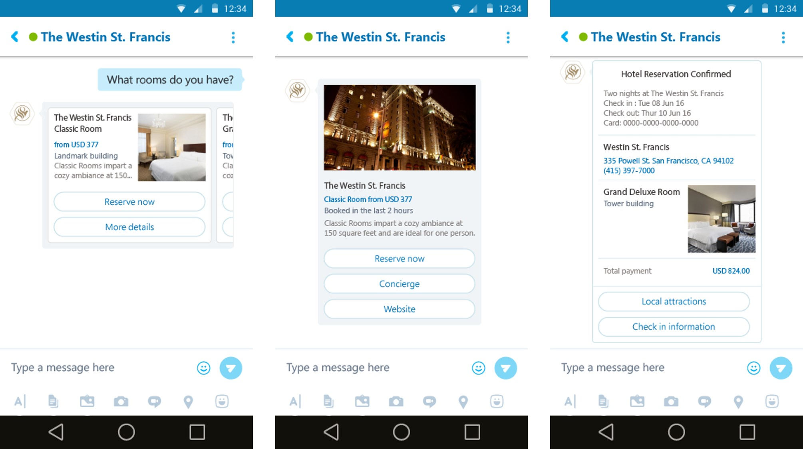
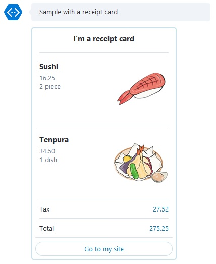
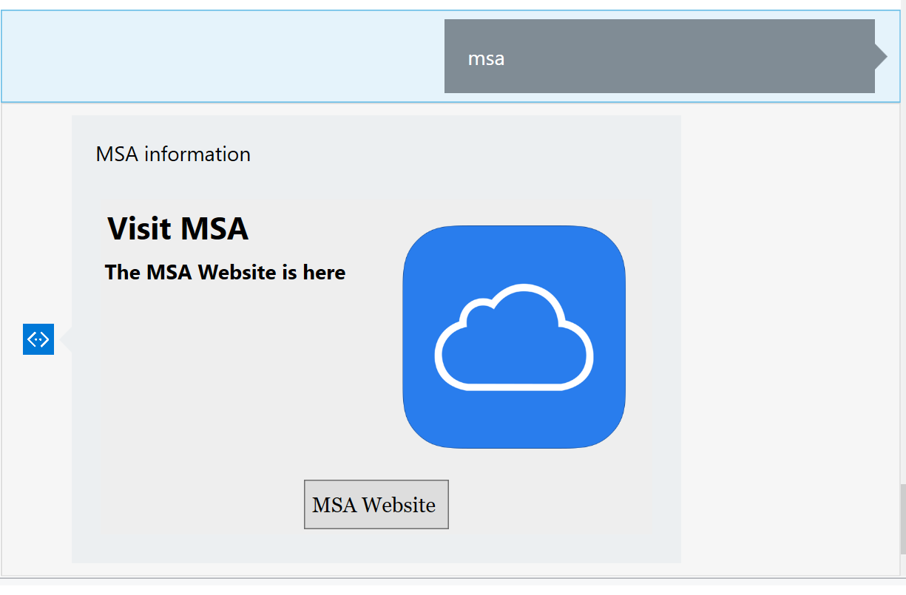

# 2.4 Bot Cards

## Introduction
To provide more visual responses back to the user, we can use cards. 

Sample cards,





This is done by attachments to replies, we can also just add simple media like (image/audio/video/file) to a reply instead.

Sample attachment
``` C#
replyMessage.Attachments.Add(new Attachment()
{
    ContentUrl = "https://upload.wikimedia.org/wikipedia/en/a/a6/Bender_Rodriguez.png",
    ContentType = "image/png",
    Name = "Bender_Rodriguez.png"      
});
```

For this tutorial we carry on from `2.3 Bot State Services` 

The completed code of the tutorial for `MessagesController.cs` has been provided in the folder as this is the only file that has changed.

## Resources
### Bootcamp Content
* [Video - Waiting](http://link.com)


## 1. Give appropriate message
In `2.4 Bot State Services` we introduced a boolean variable called `isWeatherRequest`, we will use that so we dont get multiple replies from our bot as we introduce cards it can start to look cluttering and for the command `clear` we are not seeking a weather request.

Now lets surround our info reply with an if statement, so that if its not a weather request reply with the desired message. `else` While when it is a weather request do the weather api call (surround the weather stuff in an `else` statement). 

So your replying code should look something like this, 
```C#
if (!isWeatherRequest)
{
    // return our reply to the user
    Activity infoReply = activity.CreateReply(endOutput);

    await connector.Conversations.ReplyToActivityAsync(infoReply);

}
else
{

    WeatherObject.RootObject rootObject;

    HttpClient client = new HttpClient();
    string x = await client.GetStringAsync(new Uri("http://api.openweathermap.org/data/2.5/weather?q=" + activity.Text + "&units=metric&APPID=440e3d0ee33a977c5e2fff6bc12448ee"));

    rootObject = JsonConvert.DeserializeObject<WeatherObject.RootObject>(x);

    string cityName = rootObject.name;
    string temp = rootObject.main.temp + "°C";
    string pressure = rootObject.main.pressure + "hPa";
    string humidity = rootObject.main.humidity + "%";
    string wind = rootObject.wind.deg + "°";

    // return our reply to the user
    Activity reply = activity.CreateReply($"Current weather for {cityName} is {temp}, pressure {pressure}, humidity {humidity}, and wind speeds of {wind}");
    await connector.Conversations.ReplyToActivityAsync(reply);
}
```

So we wont really be seeing our `Hello` and `Hello again` messages anymore, but by now you should have a fair understanding of how bot state services work.


## 2. MSA Card
Lets create a generic card to display MSA in order to understand cards, this will be called when the user writes `msa`

It would look like this,


Add the following code before `if (!isWeatherRequest)`
``` C#
if (userMessage.ToLower().Equals("msa"))
{
    Activity replyToConversation = activity.CreateReply("MSA information");
    replyToConversation.Recipient = activity.From;
    replyToConversation.Type = "message";
    replyToConversation.Attachments = new List<Attachment>();

    List<CardImage> cardImages = new List<CardImage>();
    cardImages.Add(new CardImage(url: "https://cdn2.iconfinder.com/data/icons/ios-7-style-metro-ui-icons/512/MetroUI_iCloud.png"));
    
    List<CardAction> cardButtons = new List<CardAction>();
    CardAction plButton = new CardAction()
    {
        Value = "http://msa.ms",
        Type = "openUrl",
        Title = "MSA Website"
    };
    cardButtons.Add(plButton);
    
    ThumbnailCard plCard = new ThumbnailCard()
    {
        Title = "Visit MSA",
        Subtitle = "The MSA Website is here",
        Images = cardImages,
        Buttons = cardButtons
    };

    Attachment plAttachment = plCard.ToAttachment();
    replyToConversation.Attachments.Add(plAttachment);
    await connector.Conversations.SendToConversationAsync(replyToConversation);

    return Request.CreateResponse(HttpStatusCode.OK);

}
```

Here we created a `ThumbnailCard` and attached:
* a list of images (`CardImage`) which we created one with a url to a cloud image
* a list of buttons (`CardAction`) which we created one with a value pointing to the msa website (http://msa.ms) and given that this action is to `openUrl` which means the URL would be opened in a browser.
* a title and subtitle for the card

NOTE: some type of cards may only accept one image or one button, like a `Hero card` only a single image is supported.

We then convert this card to an attachment and add it to the reply to the user
A `return Request.CreateResponse(HttpStatusCode.OK);` because we dont want to process or do more with the message

List of action types can be seen below,


## 3. Weather Card
Now lets change the weather response from text to something visual like a card!

It would look like this,


First lets delete the old text response, delete the following lines of code
``` C#
    // return our reply to the user
    Activity reply = activity.CreateReply($"Current weather for {cityName} is {temp}, pressure {pressure}, humidity {humidity}, and wind speeds of {wind}");
    await connector.Conversations.ReplyToActivityAsync(reply);
```

Now add the following code after `string wind = rootObject.wind.deg + "°";`
```
    // added fields
    string icon = rootObject.weather[0].icon;
    int cityId = rootObject.id;

    // return our reply to the user
    Activity weatherReply = activity.CreateReply($"Current weather for {cityName}");
    weatherReply.Recipient = activity.From;
    weatherReply.Type = "message";
    weatherReply.Attachments = new List<Attachment>();

    List<CardImage> cardImages = new List<CardImage>();
    cardImages.Add(new CardImage(url: "http://openweathermap.org/img/w/" + icon + ".png"));

    List<CardAction> cardButtons = new List<CardAction>();
    CardAction plButton = new CardAction()
    {
        Value = "https://openweathermap.org/city/" + cityId,
        Type = "openUrl",
        Title = "More Info"
    };
    cardButtons.Add(plButton);

    ThumbnailCard plCard = new ThumbnailCard()
    {
        Title = cityName + " Weather",
        Subtitle = "Temperature " + temp + ", pressure "  + pressure + ", humidity  " + humidity + ", wind speeds of "+ wind,
        Images = cardImages,
        Buttons = cardButtons
    };

    Attachment plAttachment = plCard.ToAttachment();
    weatherReply.Attachments.Add(plAttachment);
    await connector.Conversations.SendToConversationAsync(weatherReply);

}
```
* We retrieve the `icon` value from the api response, which is a code for representing the weather condition [Weather Icons](https://openweathermap.org/weather-conditions)
* We then use this icon code to display the weather condition by pointing towards the icon URL (ie http://openweathermap.org/img/w/10d.png)
* We retrieve the city's `id` from the  api response
* We then use this `id` to direct the to the city's weather on the openweathermap website by a button click
* We combine all of this into a card and display key information on the card in the `Subtitle` value, such as temperature, pressure, humidity

So now when we request for weather we are given it in a visual manner with the weather condition shown by an image and we can click a button to be redirected to find more information about the city's weather

### Extra Learning Resources
* [Bot Cards](https://docs.botframework.com/en-us/csharp/builder/sdkreference/attachments.html)
* [Weather API](https://openweathermap.org/current)